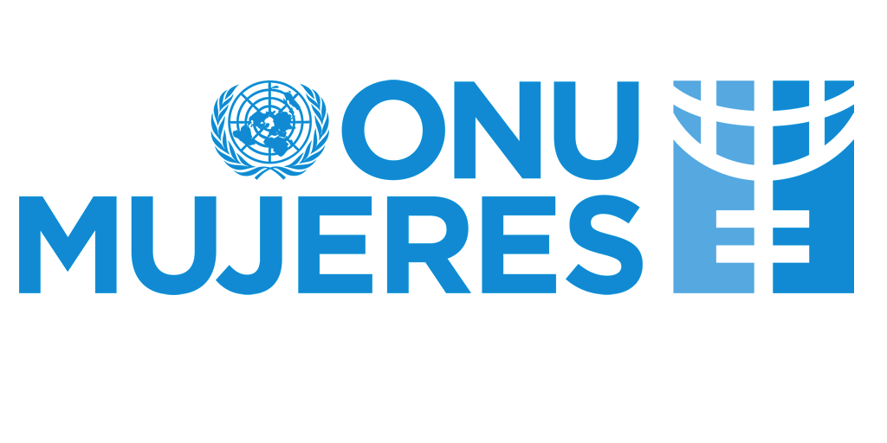

<!-- PROJECT LOGO -->
<br />
<p align="center">
  <a href="https://github.com/metalsonic21/SurveyONUMujeres">
    
  </a>

  <h3 align="center">Study about entrepreneurship and business in women</h3>

  <p align="center">
    A survey made with the goal of collecting information about businesses belonging to women
    <br />
  </p>
</p>


<!-- TABLE OF CONTENTS -->
## Table of Contents

- [Table of Contents](#table-of-contents)
- [About The Project](#about-the-project)
  - [Built With](#built-with)
- [Getting Started](#getting-started)
  - [Prerequisites](#prerequisites)
  - [Installation](#installation)
- [License](#license)
- [Notes](#notes)


<!-- ABOUT THE PROJECT -->
## About The Project

ONU Women, in the Win-Win program (joint with ILO and founded by the European Union) and PROCOMER are doing a survey about the aspects related to the offer of products and services and the necessities of the businesses leaded by women in Costa Rica. For this reason, we are needing your support to answer questions related to this.

A lot of companies are participating in this initiative because a directory of businesses leaded by women will be built with this information, also, it's expected for us to know the specific necessities of each company with the goal of creating programs and projects to help with those to promote more and better oportunities for entrepreneur women

ONU Mujeres & Procomer will take care of the confidentiality of your answers and we will publish the general stats, not individual answers, using it with investigative purposes exclusively.


### Built With

* [PHP](https://www.php.net/downloads.php)
* [MySQL](https://dev.mysql.com/downloads/installer/)
* [HTML5]()
* [JavaScript]()
* [Bootstrap 4](https://getbootstrap.com/docs/4.3/getting-started/download/)


<!-- GETTING STARTED -->
## Getting Started

To get a local copy up and running follow these simple steps.

### Prerequisites

* [XAMPP](https://www.apachefriends.org/es/index.html)

### Installation
 
1. [Clone the repo](https://github.com/metalsonic21/SurveyONUMujeres/archive/master.zip)

2. Activate Apache and MySQL services in XAMPP
3. Copy the repo folder in xampp/htdocs
4. Type "localhost" in your favorite browser
5. Once the XAMPP dashboard appears click on phpMyAdmin
6. Once you are in phpMyAdmin go to the "User accounts" tab and add the following user
   ```
   Username: FrankHesse
   Hostname: localhost
   Password: metalsonic21
   ```
7. Check all the Global privileges
8. Grant all privileges on wildcard name
9. Create a databaase called surveyonumujeres with encoding utf8_spanish
10. Create a table called encuesta with the following
    ```
    id - VARCHAR - 100 - NULL
    pregunta - VARCHAR - 2000 - NULL
    respuesta - VARCHAR - 2000 - NULL
    Storage Engine: InnoDB
    ```

<!-- LICENSE -->
## License

Distributed under the MIT License. See `LICENSE` for more information.

## Notes

If you type localhost/SurveyOnuMujeres/procesamiento.php or just double click the file it will export the database in a CSV file